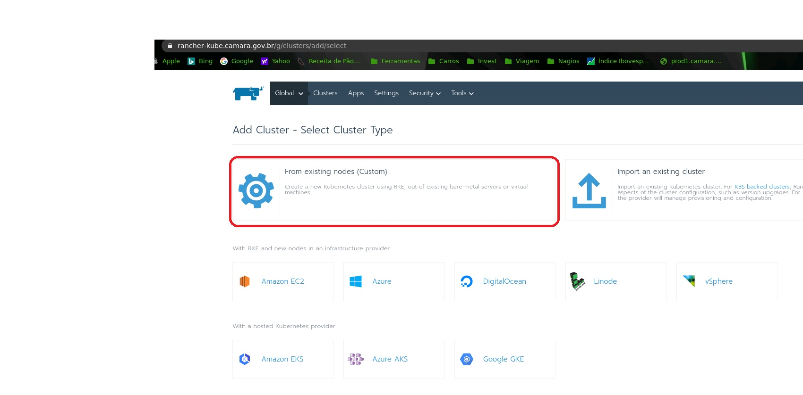
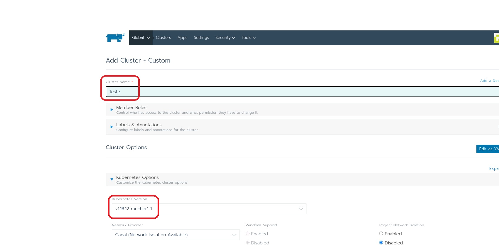
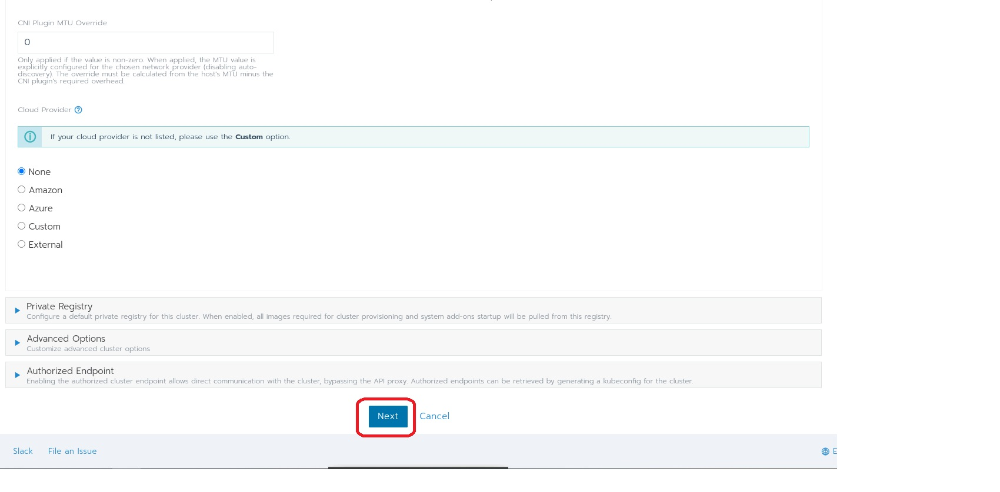
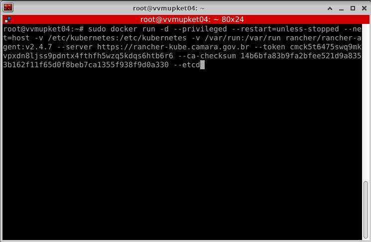

Adicionar um cluster novo 
=========================

Objetivo 
--------

O Manual tem a finalidade de explicar a crição de cluster novo na plataforma Rancher-kube 

1. Apos ter realizado os procedimentos de Construção de Máquinas e configurao conforme os manuais Preparacao de Maquinas.

2. Logar na plataforma *rancher-kube.camara.gov.br* e clicar em *Add Cluster*

.. image:: ../_static/CLUSTER/IMG1.jpg

3. Na página seguinte ser apresentado qual tipo de cluster deseja criar, no exemplo utilizaremos *Custom*

4. Alterar o nome do cluster e verificar qual versão Kubernetes

Deixar os demais campos sem alteracao e por fim clicar em *Next*

5. Escolher qual opcao a Máquina ira responder (Etcd, Control Plane ou Worker) 

.. image:: ../_static/CLUSTER/IMAGEM5.jpg

6. Copiar o script e rodar na estação

As estações serao implementadas automaticamente e o cluster está apto para receber novos projetos. 

