1 - Preparando as maquinas para Kubernetes
============================
1.1 - Formatar Maquinas Fisicas
-----------------------------
1.1.1 - Via Idrac (Manual)
-----------------------------

Criar e configurar máquinas físicas que serão utilizadas no cluster

Implantação SO Idrac
--------------------

Endereço
  https://idrac-(Numerodopatrimônio).redecamara.camara.gov.br

Idrac é a O iDRAC (Integrated Dell Remote Access Controller) foi desenvolvido para o gerenciamento seguro de servidores
locais e remotos e ajuda os administradores de TI a implementar, atualizar e monitorar os servidores Dell PowerEdge.

Manual para realizar implantação de ISO em IDRAC.
Como exemplo utilizaremos a IDRAC 340692.FCNUPKUB10 IDRAC: 10.2.1.143 Endereço de IP da Idrac
Endereço de IP de Rede 10.2.32.232 idrac-340692.redecamara.camara.gov.br

1º Necessário acessá via navegador:

.. image:: ../_static/IDRAC/IMG1.JPG

Utilizar o usuário e senha e colocar o domínio Redecamara

2º Clicar em ATTACHED MEDIA e em Remote File Share, clicar em desconectar.
Isso ocorre devido a outro server está utilizando a Mídia Virtual, impossibilitando o operador
de mapear uma nova .ISO

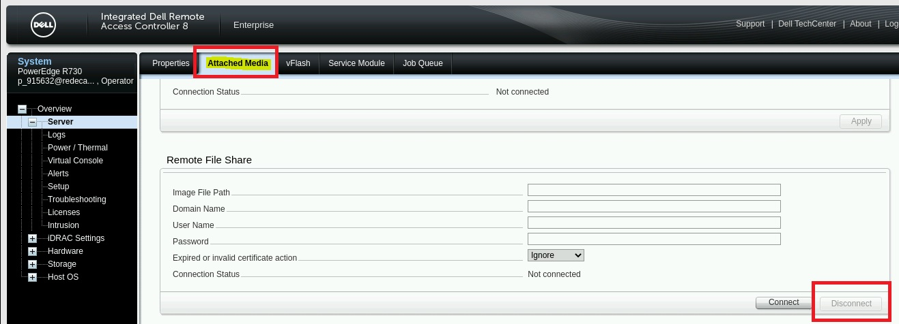

3º Retornar em Overview no lado esquerdo e Em seguida em Launch para acessar o
servidor.

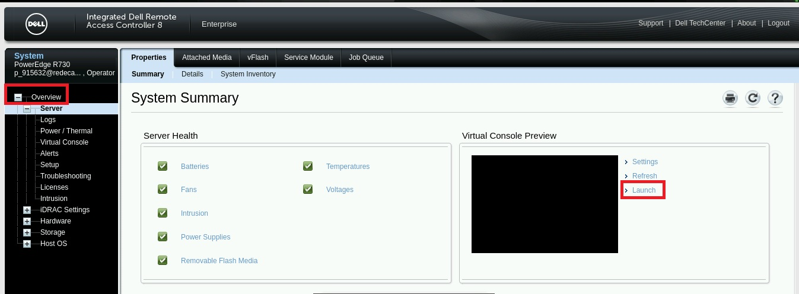
Criar e configurar máquinas físicas que serão utilizadas no cluster

Implantação SO Idrac
====================

Endereço
  https://idrac-(Numero do patrimônio).redecamara.camara.gov.br

Idrac é a O iDRAC (Integrated Dell Remote Access Controller) foi desenvolvido para o gerenciamento seguro de servidores
locais e remotos e ajuda os administradores de TI a implementar, atualizar e monitorar os servidores Dell PowerEdge.

Manual para realizar implantação de ISO em IDRAC.
Como exemplo utilizaremos a IDRAC 340692.FCNUPKUB10 IDRAC: 10.2.1.143 Endereço de IP da Idrac
Endereço de IP de Rede 10.2.32.232 idrac-340692.redecamara.camara.gov.br

1º Necessário acessá via navegador:

.. image:: ../_static/IDRAC/IMG1.JPG

Utilizar o usuário e senha e colocar o domínio Redecamara

2º Clicar em ATTACHED MEDIA e em Remote File Share, clicar em desconectar.
Isso ocorre devido a outro server está utilizando a Mídia Virtual, impossibilitando o operador
de mapear uma nova .ISO

3º Retornar em Overview no lado esquerdo e Em seguida em Launch para acessar o
servidor.

4º Mapear o disco

Na parte superior clicar em: VIRTUAL MEDIA, logo em seguida Map CD/DVD Image File
(onde mapeamos em nosso diretório o caminho da imagem no qual deseja formatar) e cliclar
em Map Device.

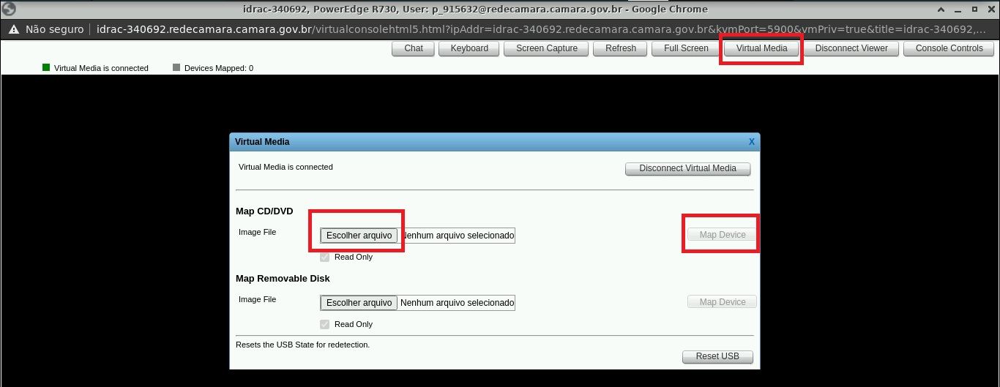
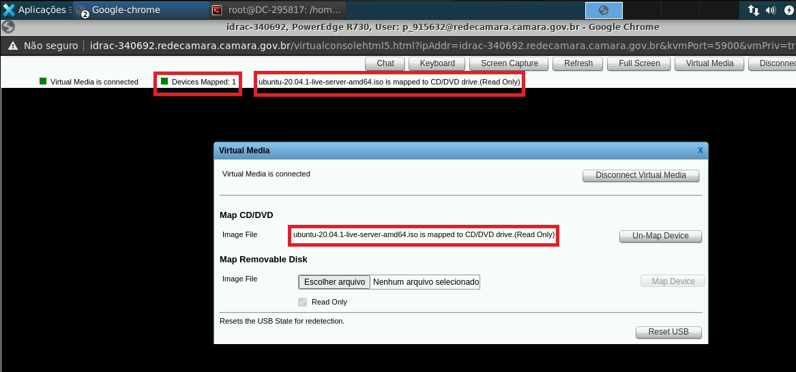

5º Fazer com que a Idrac leia o Disco como 1º para o boot:
No Canto superior possui CONSOLE CONTRS onde clicamos no botão Crtl+Alt+Del oq fará
que a idrac reinicie o server

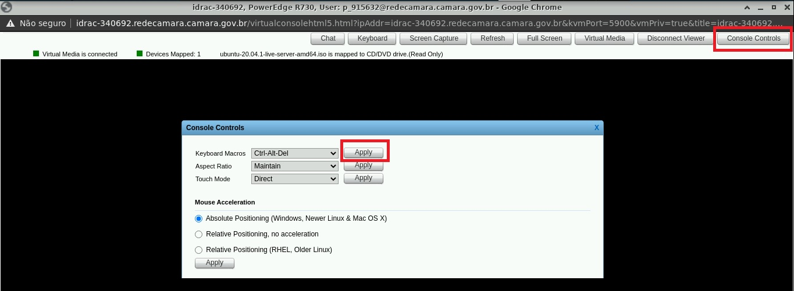
Clicar em Apply para reboot.

6º Entrar na Bios da Idrac

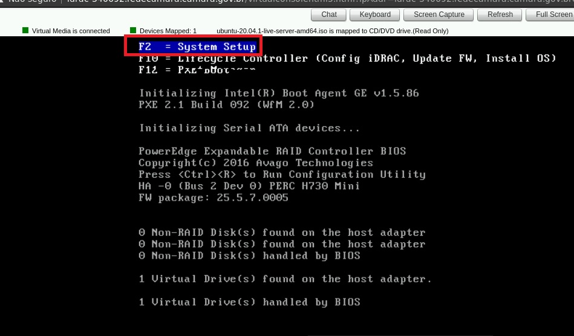

 Pressionar F2 para entrar na bios da Idrac.

7º Clicar em System Bios e navegar até BOOT SETTINGS

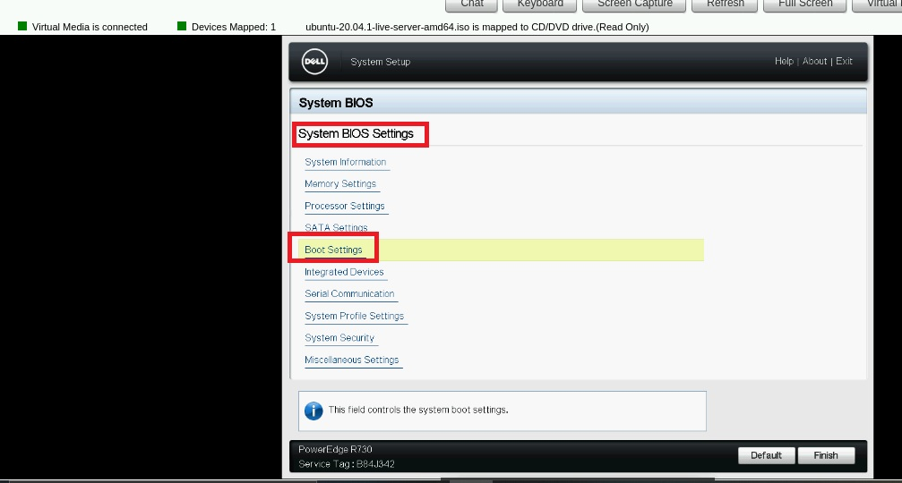

8º Ajustar o BOOT SEQUENCE para que VIRTUAL OPTICAL DRIVE seja o primeiro no
Boot

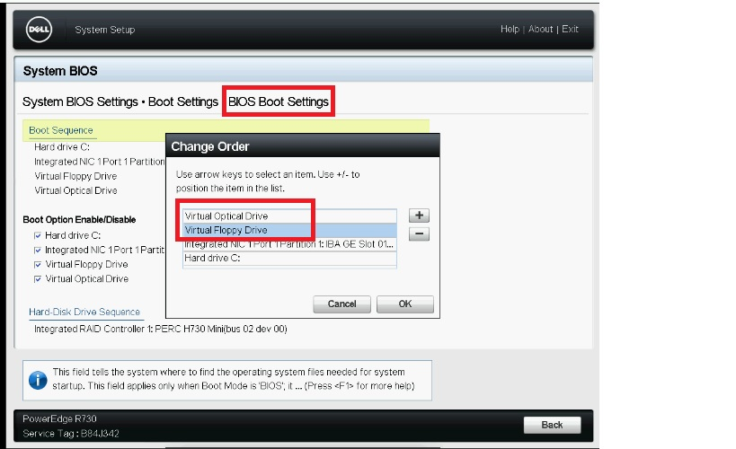

Ao Final clicar em Back e Salvar todas as configurações.
Isso fara com que a Idrac reinicie e inicie o procedimento de formatação.

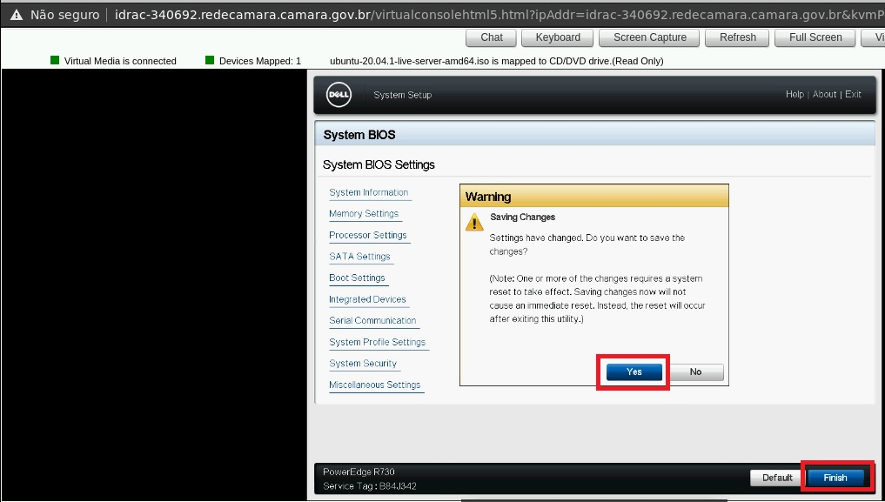

9º Ao iniciar a IDRAC com a imagem ISO mapeada ira entrar no modo de instalao Ubuntu

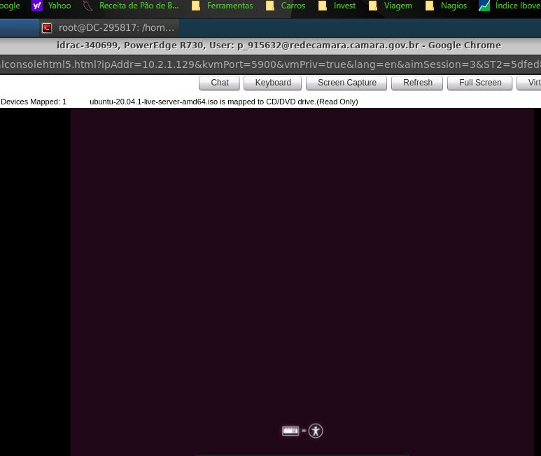

Obs.: O procedimento leva algum tempo pois faz a checagem de todo o Hardwere

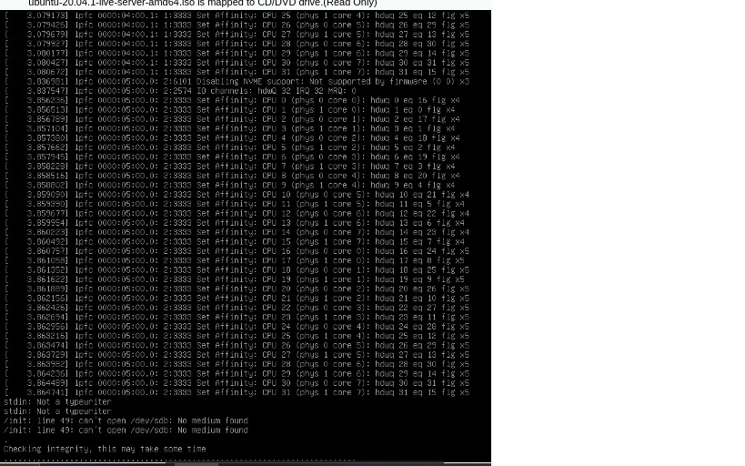

10º O primeiro menu é para escolha do idioma, Deixamos padrão English

.. image:: ../_static/IDRAC/IMG13.JPG

11º Escolhemos o layout do teclado

 .. image:: ../_static/IDRAC/IMG14.JPG

 Colocamos padrão brasileiro

12º O proximo menu é o mais importante no qual implementamos as configurações de rede.

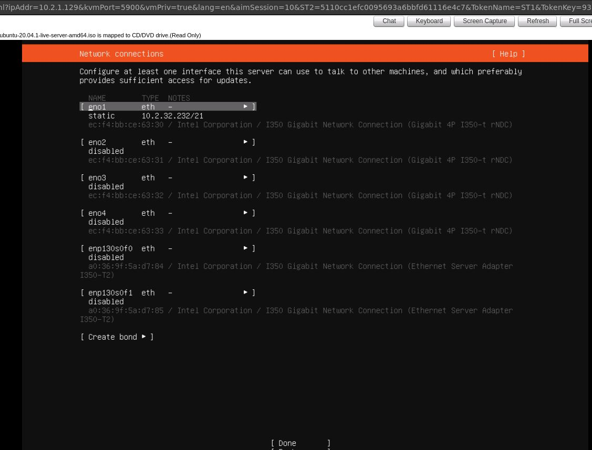

Selecione o eno0

13º Clicamos em IPV4 Edit

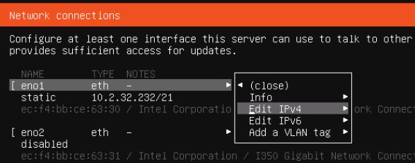

14º Editar MANUAL para implementar as configurações de Rede

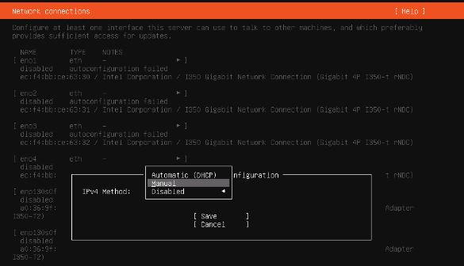

15º Implementar os seguintes valores

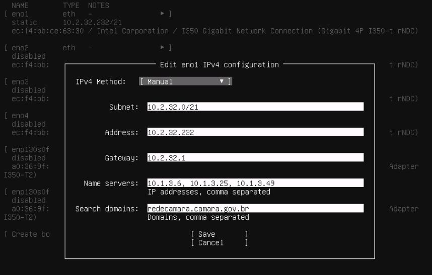

Depois salvar. OBS.: necessário o servidor validar pois já apresenta conexão de rede e com as informações OK pressionar DONE para continuar na configuração.

16º O próximo menu é para implantar um proxy. Deixamos em Branco

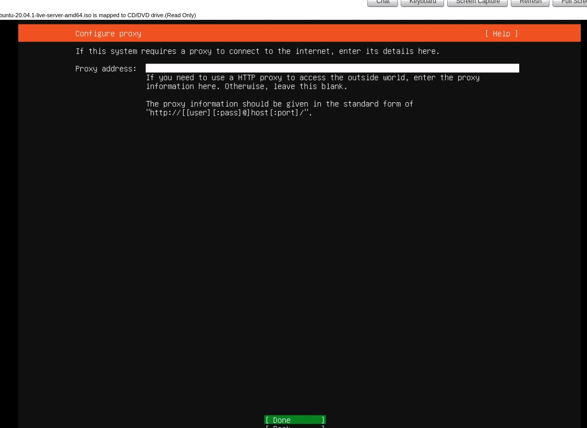

17º Um endereço de espelho onde o ubuntu busca as atualizações

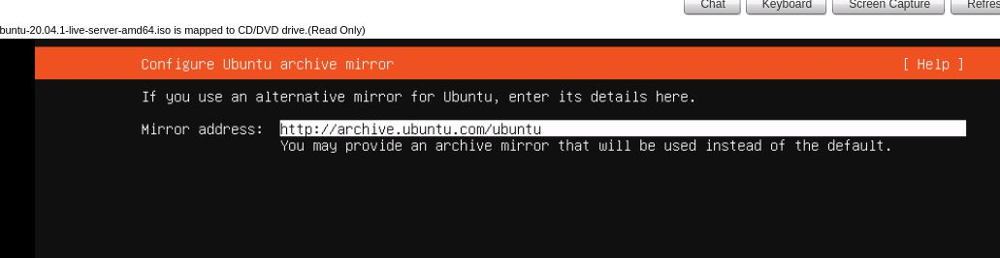

Obs.: deixamos como padrão.

18º Para criar uma nova partição devemos antes excluir a preexistente /boot e vamos criar outra conforme a img abaixo

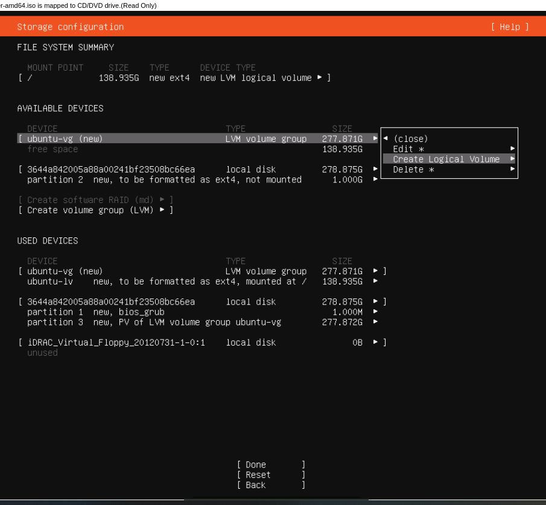

19º Obs.: Isso se dá pela necessidade de atualizações do kub que utiliza esse diretório para salvar os arquivos, por padrão tem 1gb, vamos aumentar para 2gb

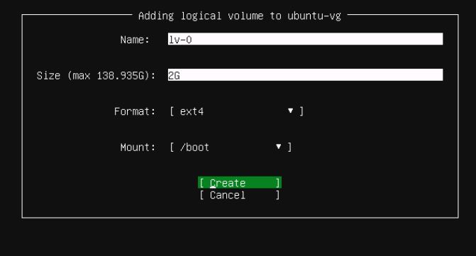

20º Conclui a divisão dos discos e salva

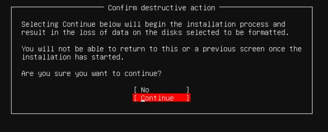

21º O Ultimo menu  para incluir as informacoes de nome da estação e usuário

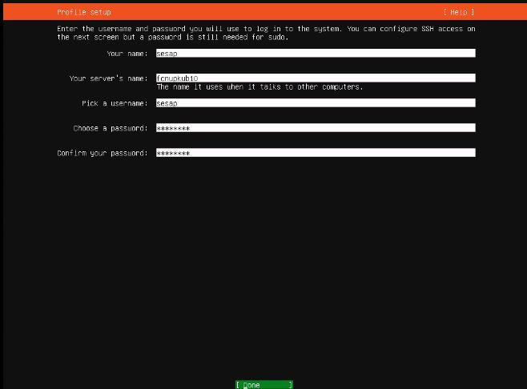

Finaliza a instalação e inicia o server.