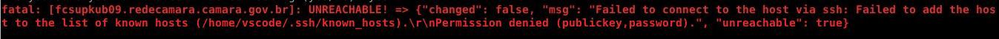
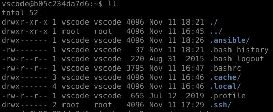
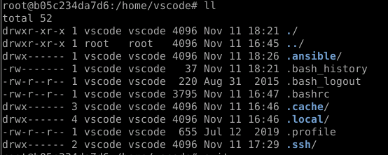

Instalação e configuração dos serviços no cluster do Kubernetes.
==============

Inserindo a chave
----------------
Utilizando o projeto **image-builder**, vamos inserir a chave pública da máquina que rodará o script do kubernete-lab:

   `cd image-builder/ssh`

   `chmod 600 insecure_key`

   `vim ~/.ssh/id_rsa.pub (copiando a chave do usuário root da máquina que executará o script)`

   `ssh -i insecure_key sesap@(máquina a será inserida a chave)`

   `sudo su`

   `vim /root/.ssh/authorized_keys (inserir a chave)`

   `vim /home/sesap/.ssh/authorized_keys (inserir a chave)`

   `ctrl+d (Depois da chave iserida pode sair da máquina)`

Configurar o ambiente para o Ansible
--------

1. Baixar o projeto que será utilizado para a configuração automatizada do cluster:

     `git clone https://git.camara.gov.br/sesap/kubernetes-lab`

2. Instalar o docker e o docker-compose instalados.
    ***Execute os comandos abaixo:***

    `export https_proxy=http://10.1.1.46:8080`

    `export http_proxy=http://10.1.1.46:8080`

    `export ftps_proxy=http://10.1.1.46:8080`

    `sudo apt install -y docker.io docker-compose`

3. Entrar no dirétorio onde será executado o script:
    `cd kubernetes-lab/cluster/`

4. Criar um container com o docker-compose. O docker-compose tem que ser executado no diretorio onde o arquivo está.
* O docker irá construir e iniciar o container.
     `docker-compose up --build -d`

* Entrar no bash do container criado:
 **obs**: *essa é uma alternativa de utilizar o bash do container*
     `docker-compose exec ansible bash`

Executar o playbook com as configurações
---------------------

Dentro do projeto **kubernetes-lab** tem um script ***apply.sh*** que será utilizado para executar o playbook para configuração e instalação dos serviços do kubernetes.
Esse playbook já irá inserir as chaves da equipe e fará ainstalação de outros serviços essenciais para o funcionamento das máquinas.

    Neste momento logará no container **ansible** com o usuário **vscode**

O script é executado com parâmetros:

- Para executar em todas as máquinas de um cluster, onde estará listado no arquivo ***hosts.yml***:
    `kubernetes-lab/cluster/provision/cluster2/ansible/hosts.yml`

     `./apply.sh  <NOMEDOCLUSTER>`

- Para executar em uma máquina especifica dentro de um cluster:
     `./apply.sh <NOMEDOCLUSTER> -l <NOMECOMPLETODAMAQUINA>.redecamara.camara.gov.br`

Quando terminar de executar o playbook:

    `ctrl+d ou exit (para sair do bash do container)`

    `docker-compose down --volumes (para desmontar os volumes que foram criados)`

Possíveis erros
---------

Caso apareça erro de permissão mesmo depois de ter inserido a chave do usuário que executará o procedimento na máquina que será configurada:

Verificar dentro do bash do container mesmo a permissão do usuário vscode no diretório .ssh:

    `sudo ll /home/vscode/.ssh`

Caso o diretorio **.ssh** esteja com permissão ***root***:

Execute o comando:

    `sudo chown -R vscode. /home/vscode/.ssh`

Deverá ficar assim:

E tente executar o comanda do ***./apply*** novamente.